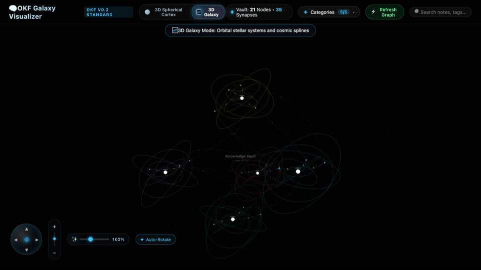
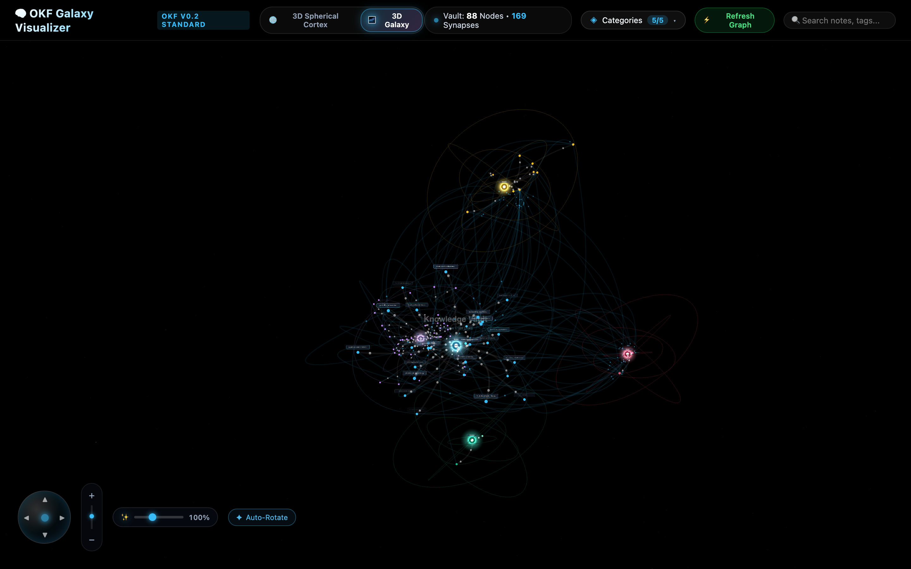
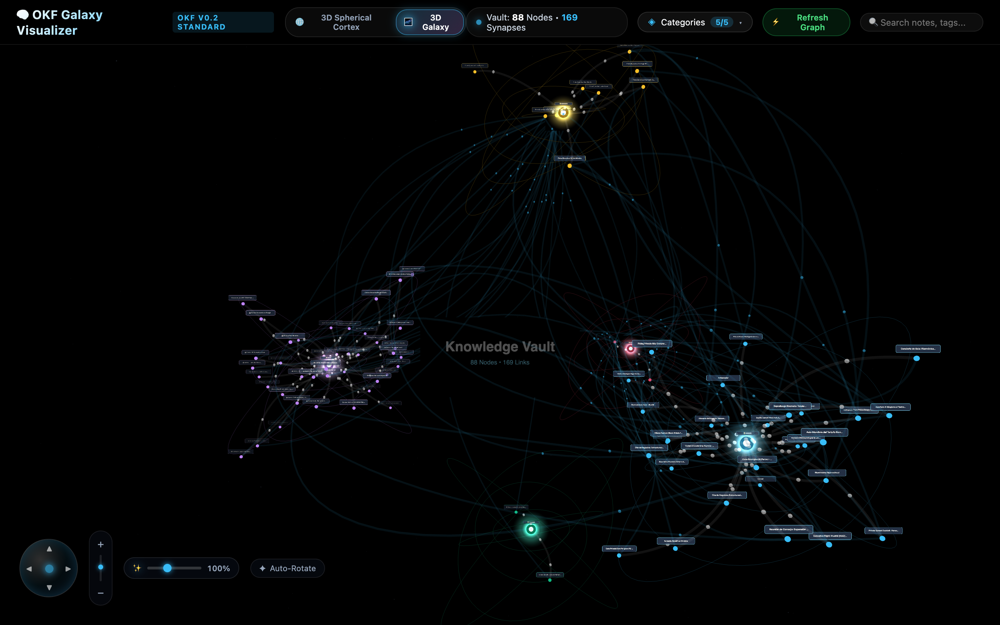

# 🌌 OKF 3D Galaxy Visualizer

[](https://opensource.org/licenses/MIT)
[](https://nodejs.org/)
[](https://github.com/OpenKnowledgeFormat/okf-spec)


> **Interactive 3D WebGL Galaxy Graph Visualizer for Open Knowledge Format (OKF v0.2) and Obsidian Markdown Vaults.**

<p align="center">
  
</p>

<p align="center">
  <em>Render any Markdown vault as an interactive 3D universe with orbital rings, celestial clusters, and glowing cosmic splines.</em>
</p>

The **OKF 3D Galaxy Visualizer** transforms standard, text-based Markdown knowledge vaults into a real-time, interactive 3D universe. Concepts and notes become planetary systems and stars, while semantic links form glowing cosmic splines and neural pathways.

---

## 🔗 Specifications & Repositories

- **Core Standard**: Built for [Open Knowledge Format v0.2 (OKF 0.2)](https://github.com/OpenKnowledgeFormat/okf-spec). Note that you need your knowledge base structured according to the **OKF v0.2 specification** described below for full 3D clustering.
- **Visualizer Repository**: [https://github.com/cabezondigital/okf-galaxy-visualizer](https://github.com/cabezondigital/okf-galaxy-visualizer)

---


## 📸 Visual Showcase

| Galactic Core & Armillary Rings | Clustered Stellar Nebulae & Splines |
| :---: | :---: |
|  |  |

---
## ✨ Features

- **🌌 3D Galaxy Orbital Mode (Default)**: Clustered stellar nebulae, celestial armillary rings, central galactic core, and curved 3D Bézier cosmic splines.
- **🔮 3D Spherical Cortex Mode**: Distributes nodes along a Fibonacci spherical shell with surface synapse arcs for dense neural mapping.
- **⚡ Universal OKF v0.2 Compatibility**: Parses YAML frontmatter, tags, category hierarchies, and Obsidian-style `[[wikilinks]]`.
- **🎨 Dynamic HSL Chromatic Clustering**: Automatically groups concepts by category and distributes them across harmonious color spectra in 3D space.
- **🔍 Real-Time Exploration HUD**: Instant search filter, category toggles, brightness control, and camera orbit navigation.
- **🚀 Zero-Database Architecture**: Reads standard `.md` files directly from disk in real time.

---

## 🚀 Quick Start

### 1. Installation

Clone the repository and install dependencies:

```bash
git clone https://github.com/cabezondigital/okf-galaxy-visualizer.git
cd okf-galaxy-visualizer
npm install
```

### 2. Run with Built-in Demo Vault

```bash
npm start
```
Open your browser at **`http://localhost:4000`**.

### 3. Run with YOUR Custom Vault

Point the visualizer to any local folder or Obsidian vault using the `--vault` flag or `VAULT_PATH` environment variable:

```bash
# Option A: CLI argument
npm start -- --vault="/path/to/your/okf-vault"

# Option B: Environment variable
VAULT_PATH="/path/to/your/okf-vault" PORT=4000 npm start
```

---

## 📐 OKF (Open Knowledge Format v0.2) Specification

To achieve maximum visual fidelity, each note in your vault should be a `.md` file containing standard YAML frontmatter and markdown body:

### Note Template (`concepts/knowledge_graph.md`):

```markdown
---
id: knowledge_graph
title: "Knowledge Graph Architecture"
type: Concept
category: Architecture
tags: ["knowledge-base", "graph", "okf"]
links: ["Open Knowledge Format (OKF v0.2)", "Galaxy Visualizer"]
description: "A structured network of semantic entities, concepts, and relationships."
---

# 🧠 [[Knowledge Graph Architecture]]

A knowledge graph organizes entities into nodes and relations into directed edges.

## Connected Concepts
- Adheres to [[Open Knowledge Format (OKF v0.2)]].
- Rendered in real-time with [[Galaxy Visualizer]].
```

### Recommended Directory Structure

```text
my-vault/
├── concepts/       # Foundational ideas, definitions, models
├── projects/       # Active initiatives, roadmaps, deliverables
├── tools/          # Software, libraries, engines, platforms
└── notes/          # Research memos, insights, general notes
```

---

## 🤖 AI Assistant Setup Prompt (Claude, GPT, Gemini)

Copy and paste the prompt below into **Claude (Anthropic)**, **ChatGPT (OpenAI)**, or **Gemini** to transform any unstructured information, notes, or ideas into an instant, perfectly-formatted **OKF v0.2** vault ready for visualization:

```markdown
You are an expert OKF (Open Knowledge Format v0.2) Knowledge Engineer.
Your task is to take my input (raw notes, ideas, conversations, or documentation) and convert it into a fully structured, interconnected OKF v0.2 Markdown Vault.

### Vault Rules & Structure:
1. Every file must be a Markdown (.md) document with strict YAML frontmatter:
---
id: unique_snake_case_id
title: "Human Readable Title"
type: Concept | Project | Note | Tool | Architecture
category: CategoryName
tags: ["tag1", "tag2"]
links: ["Exact Title of Target Note 1", "Exact Title of Target Note 2"]
description: "Concise 1-2 sentence executive summary."
---

# [Emoji] [[Note Title]]

Executive overview and key insights.

## Interconnected References
- Bidirectional link to [[Target Note 1]] with context on how they relate.
- Bidirectional link to [[Target Note 2]].

2. Folder Organization:
Organize the generated files into logical directories:
- `concepts/` (Definitions, models, foundational ideas)
- `projects/` (Initiatives, products, roadmaps)
- `tools/` (Software, scripts, hardware, platforms)
- `notes/` (Observations, research, meeting summaries)

3. Interconnectivity:
Ensure dense semantic interconnections! Every note MUST link to at least 2 other notes using `[[Note Title]]` syntax in the body and in the `links:` YAML array so the 3D visualizer generates rich stellar clusters and cosmic splines.

Please output the files clearly with their proposed relative filepath (e.g. `concepts/my_topic.md`), ready to be saved into the vault directory.
```

---

## 🛠️ REST API Endpoints

The internal Express server exposes REST endpoints for third-party integrations:

| Method | Endpoint | Description |
|---|---|---|
| `GET` | `/api/graph` | Returns nodes and links formatted for 3D-Force-Graph / WebGL. |
| `GET` | `/api/stats` | Returns aggregate statistics (total nodes, edges, density, cluster counts). |

---

## 📜 License

Distributed under the **MIT License**. See `LICENSE` for more information.
